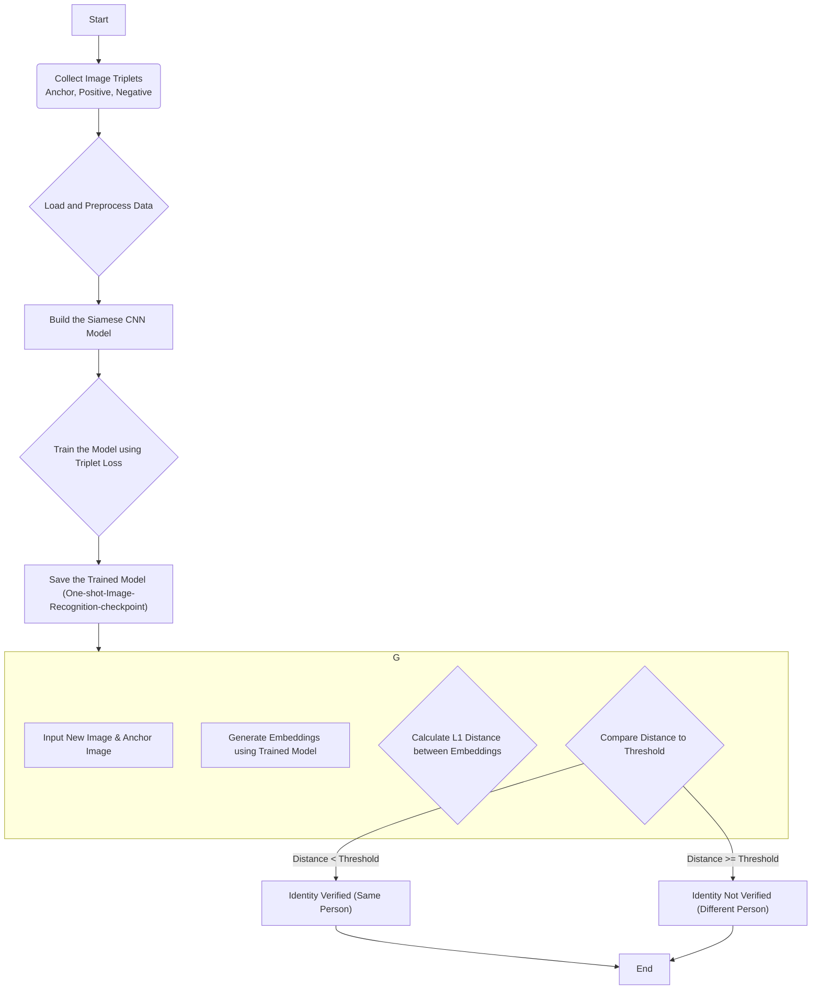

# One-Shot Face Recognition using Siamese Networks

This project implements a facial recognition system capable of verifying a person's identity from a single sample image, a technique known as **One-Shot Learning**. This is achieved using a Siamese Neural Network built with TensorFlow and Keras, which learns to compute a similarity score between two images.

[](https://www.python.org/downloads/release/python-390/)
[](https://www.tensorflow.org/)
[](https://opensource.org/licenses/MIT)

## Table of Contents
- [Project Overview](#project-overview)
- [Key Concepts](#key-concepts)
  - [One-Shot Learning](#one-shot-learning)
  - [Siamese Networks](#siamese-networks)
  - [Triplet Loss](#triplet-loss)
- [Model Architecture](#model-architecture)
- [Project Workflow](#project-workflow)
- [Directory Structure](#directory-structure)
- [Installation](#installation)
- [Usage](#usage)
- [`.gitignore` Recommendation](#gitignore-recommendation)
- [License](#license)

## Project Overview

Traditional classification models require hundreds of images per person to learn to recognize them. In contrast, this project builds a system that can recognize a person after seeing just **one** photo of them.

Instead of learning to classify *who* is in a photo, the model learns a **similarity function**. It takes two images as input and outputs a distance score indicating how similar they are. If the score is below a certain threshold, the individuals in the images are considered the same person. This is ideal for applications like Face ID, where you enroll once and the system subsequently verifies your identity.

## Key Concepts

### One-Shot Learning

The core task is **verification**. The model isn't asked "who is this?", but rather "is this the same person?". As shown below, the model is trained on pairs of images, learning to distinguish between "same" and "different" pairs. During testing (the one-shot task), it compares a new image against a single reference image to verify identity.


### Siamese Networks

To learn this similarity function, we use a Siamese Network. This architecture consists of two identical "twin" Convolutional Neural Networks (CNNs) that share the exact same weights. Each twin processes one of the two input images, converting it into a low-dimensional feature vector (an embedding). The network then calculates the distance between these two embeddings to determine their similarity. Because the weights are shared, similar images will be mapped to nearby points in the feature space.


### Triplet Loss

The model is trained using **Triplet Loss**. For each training step, we provide three images:
1.  **Anchor**: A baseline image of a person.
2.  **Positive**: A different image of the *same* person.
3.  **Negative**: An image of a *different* person.

The goal of Triplet Loss is to train the network to minimize the distance between the anchor and positive embeddings while simultaneously maximizing the distance between the anchor and negative embeddings. This effectively pushes embeddings of the same person closer together and pulls embeddings of different people further apart. The `data/` directory structure reflects this training strategy.

## Model Architecture

The core of each twin network is a deep Convolutional Neural Network. The architecture used in this project is based on the model proposed in the "Siamese Neural Networks for One-shot Image Recognition" paper. It processes a `105x105` pixel input image through a series of convolutional, ReLU activation, and max-pooling layers to generate a `4096`-dimensional feature vector. The L1 distance between the feature vectors of the two input images is then computed, followed by a final fully connected layer with a sigmoid activation to produce the similarity score.


## Project Workflow

The end-to-end pipeline for this project can be visualized in the following flowchart:


---

## Directory Structure-after you run the notebook codes
```markdown
Of course. Here is that specific section formatted as a raw Markdown code block. You can copy and paste this directly.

Markdown

## Directory Structure
FACE_MACID/
├── .ipynb_checkpoints/
├── One-shot-Image-Recognition-checkpoint/
│   └── (Saved model files)
├── data/
│   ├── anchor/
│   ├── negative/
│   └── positive/
├── env/
│   ├── bin/
│   ├── conda-meta/
│   ├── etc/
│   ├── include/
│   ├── lib/
│   ├── man/
│   ├── share/
│   └── ssl/
├── lfw-deepfunneled/
│   └── (Labeled Faces in the Wild dataset files)
└── One-shot-Image-Recognition.ipynb
```
---
## Installation

1.  **Clone the repository:**
    ```bash
    git clone [https://github.com/your-username/FACE_MACID.git](https://github.com/your-username/FACE_MACID.git)
    cd FACE_MACID
    ```

2.  **Set up the Environment:**
    The project uses a Conda environment named `env`.
    ```bash
    # Create and activate the conda environment from a file (if provided)
    conda env create -f environment.yml
    conda activate env
    
    # Or, create a new one manually
    conda create --name env python=3.9
    conda activate env
    ```

3.  **Install Dependencies:**
    It is recommended to create a `requirements.txt` file.
    ```bash
    pip install -r requirements.txt
    ```
    *Likely dependencies would include:* `tensorflow`, `opencv-python`, `numpy`, `matplotlib`, `jupyter`.

4.  **Download Dataset:**
    The `lfw-deepfunneled` directory suggests the use of the [Labeled Faces in the Wild](http://vis-www.cs.umass.edu/lfw/) dataset. Ensure this dataset is downloaded and placed in the correct directory.

## Usage

The entire workflow is contained within the Jupyter Notebook.

1.  **Activate the Conda environment:**
    ```bash
    conda activate env
    ```
2.  **Launch Jupyter Notebook:**
    ```bash
    jupyter notebook
    ```
3.  Open and run the cells in `One-shot-Image-Recognition.ipynb`.

The notebook will guide you through:
* Setting up the data paths.
* Creating the data loading pipeline.
* Defining and compiling the Siamese model.
* Training the model.
* Using the trained model to perform facial verification on new images.

## `.gitignore` Recommendation

To keep your repository clean, create a `.gitignore` file in your root directory (`FACE_MACID/`) with the following content.

```gitignore
# Conda/Python Virtual Environment
/env/

# Datasets - these should be downloaded by the user
/data/
/lfw-deepfunneled/

# Model Checkpoints - too large for Git
/One-shot-Image-Recognition-checkpoint/

# Python/Jupyter cache
__pycache__/
.ipynb_checkpoints/
*.pyc

# OS-specific files
.DS_Store
Thumbs.db
